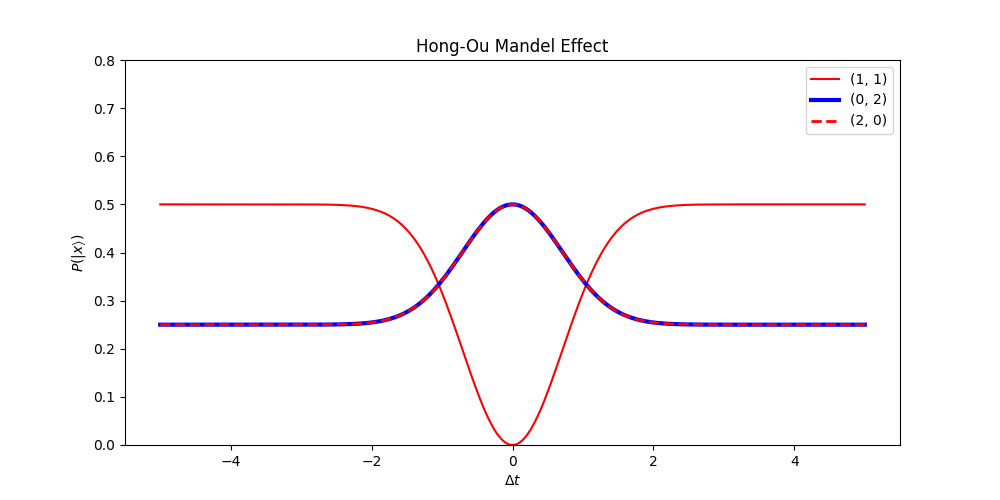
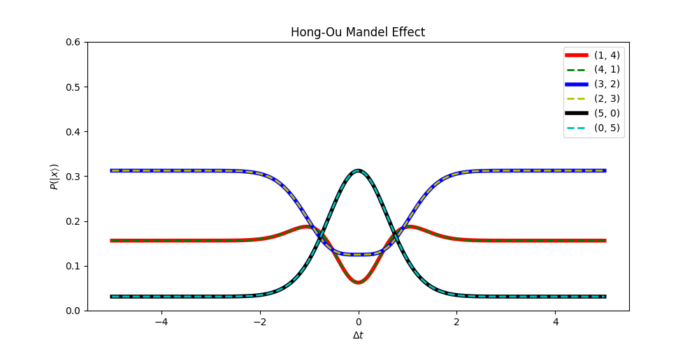
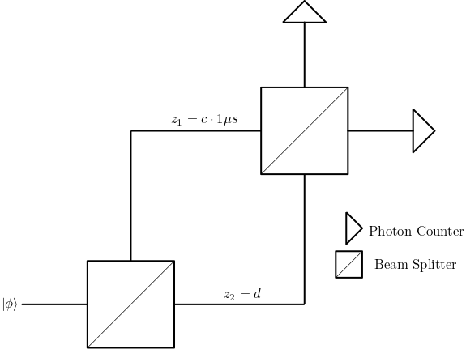

# fotini

Fotini is a general-purpose, photon simulation package. It is being actively developed
for the [Figueroa Research Group](http://qit.physics.sunysb.edu/wordpress/). The purpose
of fotini is to enable the verification and debugging of optical circuits, enabling the
following workflow:
1. Design an optical circuits with the desired properties.
2. Code the optical circuit in fotini.
3. Use fotini to generate the expected output statistics.
4. Measure experimental output statistics, and see whether they are consistent with those computed by fotini.
5. Debug, using fotini as a debugging aide to identify problems in the physical setup.

Fotini works through the efficient and correct handling of [Fock States](https://en.wikipedia.org/wiki/Fock_state). 
It computes output statistics using continuous-mode quantum mechanics, and thus
for the supported optical circuit elements, reproduces all important quantum
mechanical effects. While it supports *general* spectral amplitudes for a
particular number state, it works particularly efficiently with number states
expressible as `C_1*exp(Σa_it_i^2 + Σb_i*t_i + c)`. These covers a important
variety of real-world usage.

# Example Usage
## Reproduction of Hong-Ou Mandel Effect
The Hong-Ou Mandel effect has the set-up seen in figure (1).
<figure align="center">
  
  <figcaption>Fig. 1 Hong-Ou Mandel Effect Setup</figcaption>
</figure>

If we place one photon at each input, there are three possible cases:
1. Both photons exit through the upper output.
2. Both photons exit through the right output. 
3. One photons exits through each output.

We can measure the probability of each case. Interestingly, the timing of the
arrival of the photons affects the probability. This is not an effect expected
from classical descriptions of light. 

We place a gaussian photon with angular frequency `ω=1k rad/s`, bandwidth `Δ=1` on the first input
of the beam-splitter arriving at time `0`. This specifies `Φ_1`. The second photon, `Φ_2`, also
has angular frequency `ω=1k rad/s` and bandwidth `Δ=1`, but arrives at time `Δt`. When `Δt` is small,
a measurable inteference effect appears, and the case in which one photon is measured at each output
is no longer possible. We sample a variety of `Δt` and plot the probability of the three cases. Figure (2)
is a plot of the results.
<figure align="center">
  
  <figcaption>Fig. 2 Hong-Ou Mandel Effect with a Single Photon at Each Input</figcaption>
</figure>

The code to produce perform the calculations and produce the figure is in `examples/hom-0.py`. 

### Hong-Ou Mandel Effect with More Photons
With fotini, we can run experiments with more complex inputs that might not be
easily achievable in the real-world. Using the same experimental set-up as in
figure (1), we can instead specify the following inputs:
1.  For `Φ_1`, we place *2* Gaussian Photons, with angular frequency `ω=1k rad/s`, bandwidth `Δ=1`, and arrival time `t_0=0`. 
2. For `Φ_2`, we place *3* Gaussian Photons, with angular frequency `ω=1k rad/s`, bandwidth `Δ=1`, and arrival time `t_0=Δt`. 

We then vary `Δt` and see how the output probabilities for the various possible
output-states before. As we are now placing more photons at each inputs, there
are more possible output states. In the plot, the output state `(n, m)`
represents that `n` photons were measured at the upper output and `m` photons
were measured on the right output. Figure (3) is a plot of the results. We can
see much more complex interference behaviour arising from more photons at each input.

<figure align="center">
  
  <figcaption>Fig. 3 Hong-Ou Mandel Effect with Multiple Photons at Each Input</figcaption>
</figure>

## Mach-Zender Interferometer
The Mach-Zender interfemeter set-up can be seen in figure (4). 
<figure align="center">
  
  <figcaption>Fig. 4 Mach-Zedner Interferometer</figcaption>
</figure>
